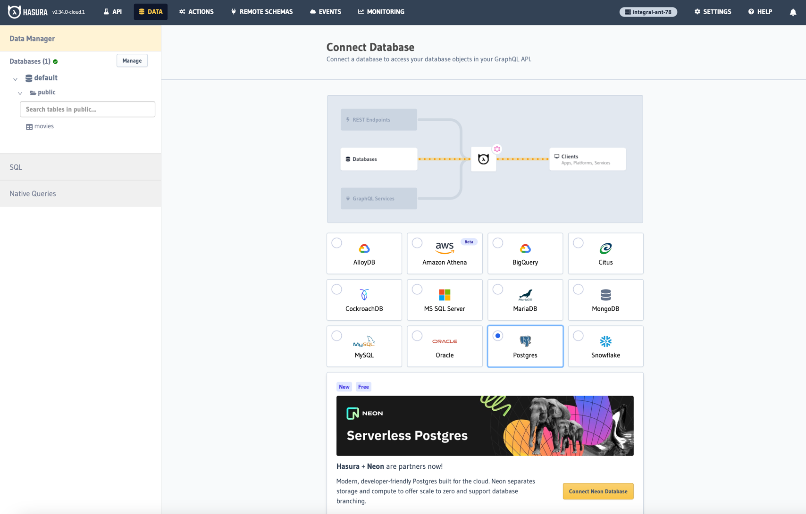

# gql-postgres-hasuraCloud
--->https://hasura.io/blog/building-a-graphql-api-with-golang-postgres-and-hasura/

```diff
--->go mod init gql-postgres
go: creating new go.mod: module gql-postgres

--->go install github.com/99designs/gqlgen@latest
go: downloading github.com/99designs/gqlgen v0.17.40

---> go mod tidy
go: finding module for package github.com/99designs/gqlgen
go: found github.com/99designs/gqlgen in github.com/99designs/gqlgen v0.17.40

---> go run github.com/99designs/gqlgen init
Creating gqlgen.yml
Creating graph/schema.graphqls
Creating server.go
Generating...

Exec "go run ./server.go" to start GraphQL server

---> deleting the schema.resolvers.go
zsh: command not found: deleting

---> go run github.com/99designs/gqlgen generate

---> go get github.com/go-pg/pg/v10                         
go: downloading github.com/go-pg/pg/v10 v10.11.1
go: downloading github.com/go-pg/pg v8.0.7+incompatible
go: downloading mellium.im/sasl v0.3.1
go: downloading github.com/go-pg/zerochecker v0.2.0
go: downloading github.com/jinzhu/inflection v1.0.0
go: downloading github.com/vmihailenco/msgpack/v5 v5.3.4
go: downloading github.com/vmihailenco/tagparser v0.1.2
go: downloading github.com/tmthrgd/go-hex v0.0.0-20190904060850-447a3041c3bc
go: downloading github.com/vmihailenco/bufpool v0.1.11
go: downloading golang.org/x/crypto v0.1.0
go: downloading github.com/vmihailenco/tagparser/v2 v2.0.0
go: downloading gopkg.in/check.v1 v1.0.0-20200227125254-8fa46927fb4f
go: added github.com/go-pg/pg/v10 v10.11.1
go: added github.com/go-pg/zerochecker v0.2.0
go: added github.com/jinzhu/inflection v1.0.0
go: added github.com/tmthrgd/go-hex v0.0.0-20190904060850-447a3041c3bc
go: added github.com/vmihailenco/bufpool v0.1.11
go: added github.com/vmihailenco/msgpack/v5 v5.3.4
go: added github.com/vmihailenco/tagparser v0.1.2
go: added github.com/vmihailenco/tagparser/v2 v2.0.0
go: added golang.org/x/crypto v0.1.0
go: added mellium.im/sasl v0.3.1

--->go mod tidy
go: downloading github.com/niemeyer/pretty v0.0.0-20200227124842-a10e7caefd8e

---> go mod tidy
go: finding module for package github.com/go-pg/pg
go: found github.com/go-pg/pg in github.com/go-pg/pg v8.0.7+incompatible
go: finding module for package github.com/onsi/gomega
go: finding module for package github.com/jinzhu/inflection
go: finding module for package mellium.im/sasl
go: finding module for package github.com/onsi/ginkgo
go: downloading github.com/onsi/ginkgo v1.16.5
go: downloading github.com/onsi/gomega v1.29.0
go: found mellium.im/sasl in mellium.im/sasl v0.3.1
go: found github.com/jinzhu/inflection in github.com/jinzhu/inflection v1.0.0
go: found github.com/onsi/ginkgo in github.com/onsi/ginkgo v1.16.5
go: found github.com/onsi/gomega in github.com/onsi/gomega v1.29.0
go: downloading golang.org/x/tools v0.12.0
go: downloading golang.org/x/crypto v0.0.0-20200622213623-75b288015ac9
go: downloading github.com/google/go-cmp v0.6.0
go: downloading github.com/nxadm/tail v1.4.8
go: downloading gopkg.in/tomb.v1 v1.0.0-20141024135613-dd632973f1e7
go: downloading github.com/fsnotify/fsnotify v1.4.9
go: downloading golang.org/x/mod v0.12.0

---> go mod vendor

--->go get "github.com/lib/pq"
go: downloading github.com/lib/pq v1.10.9
go: added github.com/lib/pq v1.10.9

---> go mod tidy      

---> go run server.go
```

Created a account with s.....6@gmail+S....5a

Click on launch console. Next page is the home page.


Now go the data tab. and create a new database with neon.


This will automatically create db in neon and you can the db in neon site (console.neon.tech)


Once the db is created an PG_DATABASE_URL is created automatically.


will also show in hasura cloud


Then create a table with columns of ur need.


Insert record if want manual or using built-in gql or rest in hasura cloud in API tab.
Or you will see next table Movies ---> try GraphQL or Create REST API.


Run the query with the play button.

Or You can the using the created GQL go run server.go

Which is not runnig due to endpoint error getting!
--->https://neon.tech/docs/connect/connection-errors


